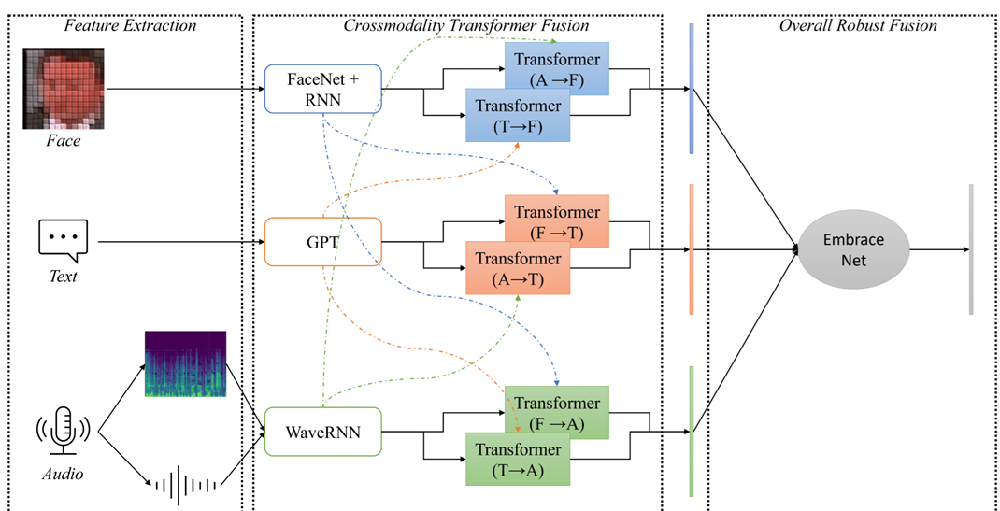

# Emotion Detection Model

This ared library can be used to detect emotion of a social scenario from either video or audio

# Model
The weights for the models used in the video can be downloaded form [here](https://drive.google.com/drive/folders/190PTe_n33NAxBpr7JslZ-2iNr1Mxx0La?usp=sharing)

The architecture of the model can be seen ibelow 

This is the implementation of the [paper](https://www.mdpi.com/1424-8220/21/14/4913).

The weighted F1 accuracy of the model on the dataset is 65%. Check the confusion matrix below
[confusion_matrix](images/confusion_matrix.png)

The model is not capable of distinguishing `fear`, `sadness` and `disgust` emotions because the MELD dataset is imbalanced and only a portion of trianing datset contains these classes.

# Installation

Download the [weights](https://drive.google.com/drive/folders/190PTe_n33NAxBpr7JslZ-2iNr1Mxx0La?usp=sharing) from the link below and place them in the weights folder

Install the library with `pip install https://github.com/eliird/ared`

The weights folder contains the weight for the following models

>vision - scene and face model, use the one depending on if you are using face images or the scene images both finetuned on the [MELD](https://affective-meld.github.io/) dataset

>audio - wavernn model trained on sentiment analysis on the [MELD](https://affective-meld.github.io/) dataset

>text - weights for gpt-2 trained for ekman emotion classes classification on [MELD](https://affective-meld.github.io/) dataset

>mmer - the weights of the cross fusion model from the [paper](https://www.mdpi.com/1424-8220/21/14/4913).


**Will possibly add the link to the noteboook which trains all these models in the future**

# Demo
You can checkout the `demo.py` to see how to use this library.
You will need to download the asr model to detect the speech from the audio.
The notebook downloads the [Qwne](https://www.modelscope.cn/models/qwen/QWen-Audio/summary) model but if you want to use another you can replace it with the model of your choice

# Usage

Loading the libraries

```
from ared import EmotionDetector
from ared import ASR
from ared.utils import (
    id2emotion, emotion2id, load_first_50_images, load_audio_from_file
)
import random

random.seed(20)

# paths containing the weights of the model
vis_weights = './weights/vision/MELDSceneNet_best.pt'
audio_weights='./weights/audio/model_best_sentiment.pth'
text_wreights = './weights/text/'

device = 'cuda'

# load the emotion detection model
detector = EmotionDetector(vis_model_weights=vis_weights, 
                           text_model_weights=text_wreights, 
                           audio_model_weights=audio_weights,
                           device=device)


```

**Detecting emotion from a video file**

```
# load the ASR model

asr_model = ASR(device)


video_path = './dia0_utt0.mp4'

utterance = asr_model.convert_speech_to_text(video_path)
emotion, probabilities = detector.detect_emotion(video=video_path, 
                                          audio=video_path, 
                                          text=utterance)
print(emotion, probabilities)
```

**Detecting emotion from the loaded_data**
```
images = load_first_50_images(video_path)
audio = load_audio_from_file(video_path)
utterance = asr_model.convert_speech_to_text(video_path)

emotion, probab = detector.detect_emotion(video=images, audio=audio, text=utterance)
print(emotion, probab)

```


